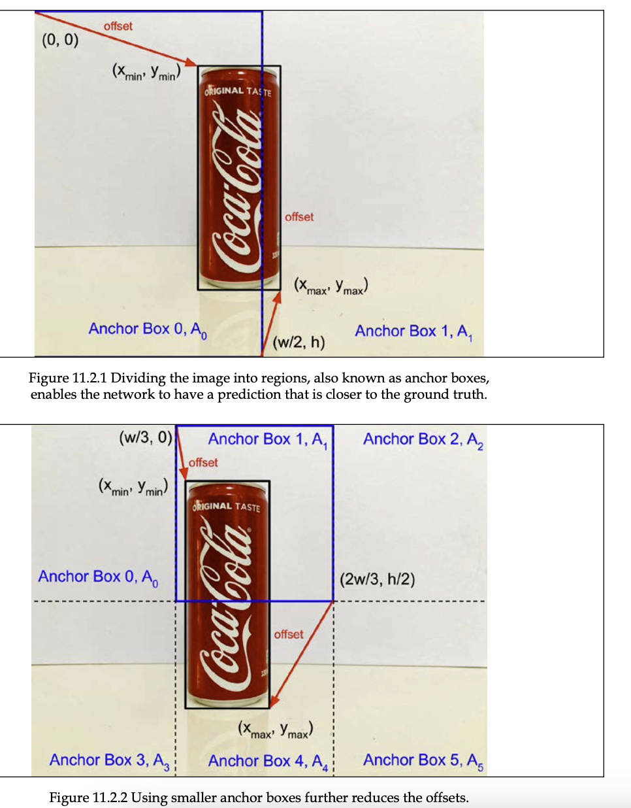
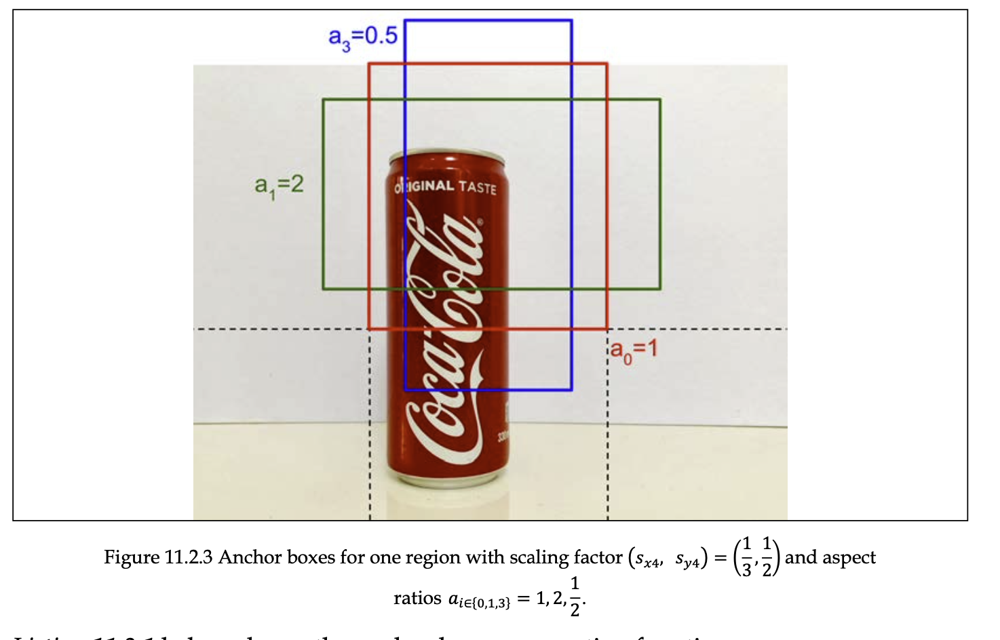
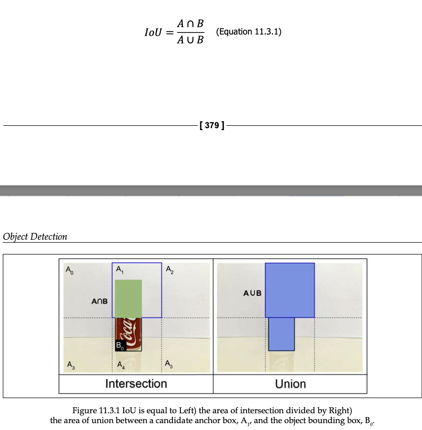

# Object detection

目標檢測是計算機視覺最重要的應用之一。 目標檢測是**同時定位(Simultaneous localization)**和**識別圖像中存在的目標的**任務。

儘管是如此的重要，目標檢測的算法檢測速度慢，精度低都是一直以來的問題。

在本章中，我們專注於實時目標檢測。 特別是，我們討論了 tf.keras 中**單次檢測 (SSD)** 的概念和實現。 與其他深度學習檢測算法相比，SSD 在現代 GPU 上實現了實時檢測速度，而性能沒有顯著下降。 SSD 也很容易進行端到端訓練。

## Anchor boxes錨框

從之前的內容得出，目標檢測需要同時找到目標的位置和類別，<u>假設我們的重點是邊界框坐標估計。</u>

但是網路如何預測坐標`(Xmin,Ymin),(Xmax,Ymax)`呢？神經網路可以初始假設`(0,0),(w,h)`對應左上角的像素坐標和右下角的像素坐標。

>  `w`代表圖像的寬度，`h`代表圖像的高度

然後，網絡通過對地面實況邊界框坐標進行<u>回歸來迭代地糾正估計</u>。

使用原始像素估計邊界框坐標不是最佳的，因為
可能像素值的高方差。 SSD 不是原始像素，而是最小化地面實況邊界框和預測邊界框坐標之間的像素誤差值。 對於此示例，像素誤差值為` (xmin, ymin) `和`(xmax – w, ymax – h)`。 這些值稱為偏移量。

為了幫助網路去找到正確的候選框的坐標，圖像被分為區域`regions`,每個區域被稱錨框。

然後，**<u>網絡估計每個錨框的偏移量。 這導致預測更接近基本事實。</u>**

舉例來說：

下圖被分為兩個錨框，新的偏差可能是`(Xmin,Ymin)`和`(Xmax-w/2,Ymax-h)`

和沒錨框相比，像素誤差是小的。第二個錨框的像素誤差會更小。

第二張圖片的錨框，偏差為`(Xmin-w/3,Ymin)`和`(Xmax-2w/3,Ymax-h/2)`

主要思想是在創建區域的過程中
各種尺寸，最接近地面的最佳錨箱尺寸
真相邊界框將出現。 <u>使用多尺度錨框來有效檢測不同大小的物體是多尺度物體檢測算法概念的基礎。</u>

找到一個可選的錨框不是零消耗的，特別是，有額外的錨框，其偏移比使用整個圖像更糟糕。

在這種情況下，SSD 提出這些錨框不應該對整體優化過程有貢獻，必須被抑制。 在接下來的章節中，將討論排除非最優錨框的算法

----

我們還需要多少組錨框？這取決於圖像的尺寸和對象的最小邊界框的尺寸。

對於640x480的尺寸圖片來說，使用 40x30 網格的錨框，最小的錨框轉換輸入圖像的 16x16 像素塊。

也稱為感受野，到目前為止，邊界框的總數是1608，從最小的，所有大小的縮放因子可以概括為

`s = [(1/2,1),(1/3,1/2),(1/5,1/4),(1/10,1/8),(1/20,1/15),(1/40,1/30)]`

如何讓錨框繼續提升呢，偏差可能會減少如果我們允許錨框有不同的aspect ratios縱橫比。

s

每個調整大小的錨框的質心與原始錨框相同。 除了縱橫比 1 之外，SSD [2] 還包括其他縱橫比：

`a= [1,2,3,1/2,1/3]`

對於每一個縱橫比，對應的錨框維度是

我們已經介紹了錨框如何協助對象檢測，以及它們是如何生成的。 在下一節中，我們將研究一種特殊的錨框：ground truth 錨框。 給定圖像中的一個對象，它必須被分配給許多錨框之一。 這稱為地面實況錨箱。

## Ground truth anchor boxes地面真值錨箱

> only one of all anchor boxes should be associated with the ground truth bounding boxes.all other anchor boxes are background anchor boxes.所有錨框中只有一個應該與地面真實邊界框相關聯。所有其他錨框都是背景錨框。

选择地面真值木框的准则又是什么呢？

> The basis for choosing the anchor box is called **Intersection over Union(IoU)交并比**

IoU等於重疊區域除以合併區域的面積

請注意，對於每個對象，只有一個基於公式 11.3.2 `Aj(gt) =maxjIoU(Bi,A)`的真值錨框。 此外，必須對所有縮放因子和尺寸（縱橫比和附加尺寸）的所有錨框進行最大化。 在圖 11.3.1 中，在 9,648 個錨框中只顯示了一個縮放因子大小。

木框A1也被称<u>为postive anchor box</u>

正錨框的類別和偏移量是根據其地面真實邊界框確定的。 positive anchor boxes 的類別和它的 ground truth bounding boxes 是一樣的。 同時，正錨框偏移量可以計算為等於地面真值邊界框坐標減去它自己的邊界框坐標。

**IoU计算过程**

